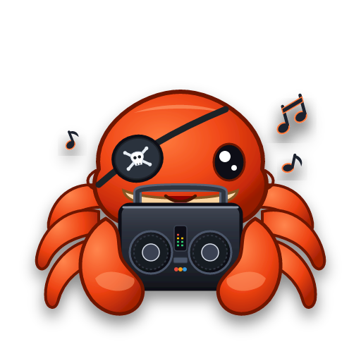

# 🦀 CaranguejoRPG — Escudo do Mestre & Bot de Áudio para Discord

<div align="center">



**O painel tudo-em-um definitivo para Mestres de RPG de Mesa (D&D 5e, Tormenta20, Ordem Paranormal, Vampiro/WoD e Call of Cthulhu).**

[](https://nodejs.org/)
[](https://react.dev/)
[](https://www.typescriptlang.org/)
[](https://discord.js.org/)
[](https://neutralino.js.org/)
[](https://www.docker.com/)

[Funcionalidades](#-funcionalidades-principais) •
[Início Rápido](#-como-executar-e-usar) •
[Gerar .EXE Portátil](#-gerar-o-executável-portátil-exe) •
[Configurar Bot Discord](#-configuração-do-bot-do-discord) •
[Estrutura de Pastas](#-estrutura-de-arquivos-e-pastas) •
[GitHub Actions](#-compilação-automática-no-github-actions)

</div>

---

## 📖 Visão Geral

O **CaranguejoRPG** nasceu para resolver o maior desafio das mesas de RPG online e presenciais: **a sobrecarga do Mestre**. Em vez de alternar entre 10 abas de navegador, bots de música instáveis e planilhas de anotação, o CaranguejoRPG unifica tudo em uma interface escura, rápida, sem lag e focada em imersão sonora.

Ele funciona tanto no **navegador**, quanto como um **aplicativo de desktop portátil (.exe de apenas ~5MB)** sem necessidade de instalação, ou dentro de um container **Docker**.

---

## ✨ Funcionalidades Principais

### 🛡️ 1. Escudo do Mestre Integrado (Master Screen)
* **Controle Central de Áudio:** Play/Pause, pular faixa, controle de volume mestre e da música com fade suave.
* **Mini Soundboard de Resposta Rápida:** Dispare passos, espadas colidindo, magias e monstros com 1 clique.
* **Rastreador de Iniciativa & Combate:** Ordene turnos de jogadores e monstros, acompanhe PV (Pontos de Vida), CA (Classe de Armadura) e condições ativas.
* **Rolador de Dados 3D & Clássico:**
  * Dados tradicionais: d4, d6, d8, d10, d12, d20, d100 com modificadores e soma automática.
  * Rolador especializado de **Storyteller / World of Darkness (Vampiro a Máscara, Lobisomem, etc.)**: cálculo de sucessos na dificuldade alvo, falhas críticas (cancelamento no 1) e especialização no 10.
* **Envio Rápido para o Discord:** Envie narrações, falas de NPCs e avisos diretamente para o canal de texto do Discord com embeds formatados.

### 🌿 2. Player de Ambientação & Loops Contínuos (Novo!)
* **Canal Independente de Áudio:** Toque som ambiente ao mesmo tempo que a trilha musical, sem que um corte o outro.
* **Loops Imersivos:** Chuva torrencial, ventania na tundra, murmúrio de taverna, estalar de fogueira, ruínas assombradas e masmorras gotejantes.
* **Volume Separado no Mixer:** Ajuste fino de volume para manter a chuva suave sem abafar a música ou as vozes na chamada.
* **Pastas e Categorias Próprias:** Organize seus sons em `data/ambience/` e importe arquivos locais com 1 clique.

### 🎵 3. Player de Músicas & Trilha Sonora
* **Fila de Reprodução Inteligente:** Crie filas por bioma (Taverna, Combate Épico, Floresta Sombria, Dungeon, Exploração).
* **Crossfade & Loops Contínuos:** Toque trilhas em loop contínuo sem interrupções bruscas.
* **Upload Direto por Arraste (Drag & Drop):** Adicione arquivos `.mp3`, `.wav` e `.ogg` direto na janela.
* **Controle de Volume no Discord:** Volume ajustável em tempo real que afeta o bot na chamada de voz.

### ⚔️ 4. Gerador de Encontros Aleatórios (Novo!)
* **Parâmetros Paramétricos para o Mestre:** Defina o nível do grupo (1 a 20), o ambiente (floresta, masmorra, cidade, caverna, montanha, pântano, deserto, alto mar), a quantidade de inimigos (chefe solo, patrulha ou horda) e a dificuldade (fácil a mortal).
* **Fichas e Estatísticas Rápidas:** PV sugerido, Classe de Armadura (CA), Nível de Desafio (CR), papel tático e habilidades marcantes.
* **Perigos do Terreno & Complicações:** Armadilhas naturais, desmoronamentos, fumaça asfixiante e clima adverso.
* **Objetivo & Motivação Tática:** Motivações verossímeis para os inimigos (emboscada, sequestro, defesa de covil).
* **Envio Direto ao Discord:** 1 clique para postar o encontro formatado no chat dos jogadores ou do mestre.

### 🎡 5. Roleta Customizável com Porcentagens (Novo!)
* **Roda Visual Interativa:** Fatias desenhadas proporcionalmente aos pesos percentuais com animação suave de rotação e ponteiro superior.
* **Porcentagens Customizáveis:** Adicione ou remova opções, altere nomes, cores e valores de peso (com botão de normalização para 100%).
* **Predefinições Rápidas de RPG:**
  * Destino do Herói (Sorte vs Desastre)
  * Quem é o Alvo do Ataque? (Divisão entre classes)
  * Clima da Viagem (Ensolarado a Tempestade)
  * Tensão & Sanidade (Mente Firme a Frenesi)
* **Envio do Resultado ao Discord:** Publica no canal de texto qual opção foi sorteada e a probabilidade de cada fatia.

### ⚡ 6. Soundboard com Efeitos Instantâneos (SFX)
* **Atalhos e Ícones Personalizados:** Organize sons de impacto, magias, monstros, ambientação e reações.
* **Volume Individual por Efeito:** Regule o volume de cada som separadamente para não estourar os ouvidos dos jogadores.
* **Reprodução Sobreposta:** Dispare múltiplos efeitos sonoros ao mesmo tempo por cima da música de fundo e do ambiente.

### 🧙 7. Galeria de NPCs & Retratos
* **Fichas Rápidas:** Nome, Raça, Classe, Alinhamento, PV, CA, Atributos e notas de interpretação.
* **Retratos e Imagens:** Upload de retratos dos personagens e monstros.
* **Envio de Fala no Discord:** Clique em "Falar como NPC" para o bot postar no chat com o nome e avatar do NPC!

### 💬 8. Chat & Mensageiro do Discord
* **Simulador de Embeds:** Veja em tempo real como sua mensagem aparecerá no servidor.
* **Modos de Envio:**
  * 📜 *Narração em Itálico*
  * 🗣️ *Fala de Personagem / NPC*
  * 📢 *Anúncio em Caixa de Destaque com Cor*
  * 💬 *Texto Simples*

### 💾 6. Gerenciamento de Sessões & Pastas Locais
* **Saves em 1 Clique:** Salve o estado da mesa (trilhas ativas, NPCs criados, combate atual) e carregue em segundos.
* **Pastas Externas Abertas:** Seus arquivos ficam salvos em `data/` em formato aberto (JSON e MP3), facilitando backups e migrações.

---

## 🚀 Como Executar e Usar

Você pode escolher a forma mais conveniente para a sua mesa:

### 🌟 Opção 1: Executável Portátil (Mais Fácil — Sem Instalar Nada!)
1. Baixe o arquivo **`CaranguejoRPG-Portable-Windows.zip`** na aba [Releases](../../releases) ou nos [Artifacts do GitHub Actions](../../actions).
2. Extraia o arquivo ZIP em qualquer pasta (ou em um Pen Drive).
3. Dê dois cliques em **`CaranguejoRPG.bat`** (ou `CaranguejoRPG-win_x64.exe`).
4. O app abrirá instantaneamente em uma janela nativa super leve!

---

### 💻 Opção 2: Executar no Navegador com Node.js

#### No Windows:
1. Tenha o [Node.js (versão 18 ou superior)](https://nodejs.org/) instalado.
2. Dê dois cliques no arquivo **`iniciar-mesa.bat`**.
3. O script instalará as dependências na primeira vez e abrirá seu navegador automaticamente em `http://localhost:3000`.

#### No Linux / macOS:
```bash
chmod +x ./iniciar-mesa.sh
./iniciar-mesa.sh
```

---

### 🐳 Opção 3: Usando Docker & Docker Compose

Ideal para quem quer deixar o bot rodando 24/7 em um servidor ou Raspberry Pi:

```bash
# 1. Clone o repositório
git clone https://github.com/seu-usuario/CaranguejoRPG.git
cd CaranguejoRPG

# 2. Crie o arquivo .env com seu token
cp .env.example .env
# Edite o .env e coloque seu DISCORD_BOT_TOKEN

# 3. Suba o container
docker compose up -d
```

Acesse o painel pelo navegador em `http://localhost:3000`.

---

## 📦 Gerar o Executável Portátil (.EXE)

Se você alterou o código e quer compilar seu próprio `.exe` standalone:

### No Windows:
Dê dois cliques no arquivo **`gerar-executavel.bat`** (ou execute no terminal):
```cmd
gerar-executavel.bat
```

### No Linux / macOS:
```bash
chmod +x ./gerar-executavel.sh
./gerar-executavel.sh
```

O script criará a pasta **`dist-portable/`** contendo:
* **`CaranguejoRPG-win_x64.exe`** (Executável do Neutralino.js de ~5MB)
* **`CaranguejoRPG.bat`** (Iniciador automático de 1 clique)
* **`resources.neu`** (Pacote com o frontend compilado)
* **`data/`** (Pasta para suas músicas, sons e saves)
* **`.env`** (Configurações do Discord)

---

## 🤖 Configuração do Bot do Discord

Para transmitir a música para o canal de voz do seu servidor e enviar mensagens no chat:

### Passo 1: Criar o Aplicativo no Discord
1. Acesse o [Discord Developer Portal](https://discord.com/developers/applications).
2. Clique em **"New Application"** e dê o nome de **CaranguejoRPG**.
3. Vá na aba **Bot** no menu lateral esquerdo.
4. Clique em **"Add Bot"** (ou "Reset Token") e **copie o Token gerado**.

### Passo 2: Ativar as Privileged Gateway Intents (Obrigatório!)
Na mesma aba **Bot**, role a página até **"Privileged Gateway Intents"** e **ative as opções**:
* ✅ **MESSAGE CONTENT INTENT** (Essencial para ler rolagens de dados e comandos `\caranguejo` e `\help` no chat)
* ✅ **SERVER MEMBERS INTENT**
* ✅ **PRESENCE INTENT**
* *(Clique em "Save Changes" no final da página)*.

### Passo 3: Configurar Instalação de Guilda & Convidar o Bot
Os usuários podem adicionar seu app a uma guilda, dando a ele permissões para realizar ações nessa guilda.

No Discord Developer Portal, vá na aba **Installation** (ou **OAuth2** → **URL Generator**):
1. **Escopos (Scopes):**
   * ✅ `applications.commands` (Comandos de barra e interações)
   * ✅ `bot` (Adiciona o bot à guilda)
2. **Permissões (Bot Permissions):**
   * ✅ `Conectar` (Connect — transmissão para canal de voz)
   * ✅ `Enviar mensagens` (Send Messages — narrações e resultados de rolagens)
   * ✅ `Usar comandos de barra` (Use Slash Commands / Application Commands)
   * ✅ `Ver canais` (View Channels)
   * ✅ `Ver histórico de mensagens` (Read Message History)
   * ✅ `Inserir links` e `Anexar arquivos` (Embed Links & Attach Files — retratos de NPCs)
3. Copie o link de instalação gerado e autorize o bot no seu servidor de RPG.

### Passo 4: Ativar o Modo Desenvolvedor no Discord (para pegar IDs)
1. No seu Discord, abra as **Configurações de Usuário** (ícone de engrenagem) → **Avançado**.
2. Ative a opção **"Modo de Desenvolvedor"**.
3. Agora você pode clicar com o botão direito no seu Servidor ou Canais e escolher **"Copiar ID"**.

### Passo 5: Salvar no CaranguejoRPG
Abra o **CaranguejoRPG**, clique no botão **"Discord"** no cabeçalho (ou edite o arquivo `.env`) e preencha:
* **Bot Token:** Cole o token copiado no Passo 1.
* **ID do Servidor (Guild ID):** Clique com botão direito no ícone do servidor → *Copiar ID*.
* **ID do Canal de Voz:** Clique com botão direito no canal de voz onde todos jogam → *Copiar ID*.
* **ID do Canal de Texto:** Clique com botão direito no canal de texto do chat → *Copiar ID*.

Clique em **"Salvar & Conectar Bot"**. O bot entrará na sala de voz imediatamente!

---

## 🦀 Comandos de Chat no Discord

Qualquer jogador ou mestre pode usar estes comandos diretamente no chat de texto do servidor:

| Comando | Descrição | Exemplo |
| :--- | :--- | :--- |
| `\caranguejo` | Sorteia e posta uma **curiosidade biológica sobre caranguejos** acompanhada de um **gancho épico de campanha de RPG** | `\caranguejo` |
| `\caranguejo [n]` | Exibe uma curiosidade específica pelo ID numérico | `\caranguejo 4` |
| `\help` ou `\ajuda` | Mostra o **manual completo de comandos e regras** formatado em embed dourado | `\help` |
| `\r [dados]` | Rola dados D10 do sistema Storyteller (sucessos no 7+, 10s explodem, 1s cancelam) | `\r 7d10 Furtividade` |
| `\kr [dados]` | **Keen Roll** para Storyteller (críticos ativam no 9 e 10 e continuam explodindo) | `\kr 8d10 Tiro Certeiro` |
| `!ping` | Testa se o bot e a mesa estão respondendo | `!ping` |

---

## 🩺 Diagnóstico de Voz & Motor de Áudio Opus

O **CaranguejoRPG** conta com uma aba dedicada de **Diagnóstico & Logs** dentro do modal do Discord (acessível pelo botão *"Diagnóstico & Logs"* ou pelo botão *"Diagnóstico"* no card de status).

### Motor Híbrido de Codificação Opus:
O Discord Voice necessita de um codificador Opus para transmitir os pacotes de áudio. O CaranguejoRPG utiliza uma arquitetura resiliente com redundância automática:

1. **`@discordjs/opus` (Nativo C++):** Utilizado para máxima performance quando compiladores nativos (Visual Studio C++ Build Tools ou gcc) estão disponíveis no sistema operacional.
2. **`opusscript` (JavaScript / WebAssembly):** Codificador portátil autônomo. **Não requer nenhuma ferramenta C++ ou Python instalada**. Se o módulo nativo não puder ser compilado na sua máquina, o CaranguejoRPG faz o fallback transparente e reproduz suas músicas e SFX com 100% de fidelidade!
3. **`ffmpeg-static` & `tweetnacl`:** Binários de transcodificação e criptografia já inclusos e pré-configurados.

### Painel de Diagnóstico em Tempo Real:
* **Inspeção de Decodificadores:** Verifica o status do `@discordjs/opus`, `node-opus` e `opusscript`.
* **Métricas de Conexão:** Exibe status do canal de voz (`ready`, `connecting`, `idle`), latência em milissegundos e estado do player.
* **Botão "Testar Voz":** Executa um teste em 1 clique do pipeline de codificação de áudio.
* **Terminal de Logs Interativo:** Filtre logs por erros, eventos de voz, áudio ou sistema, com suporte a cópia de mensagens e exportação de relatório completo em JSON.

---

## 📂 Estrutura de Arquivos e Pastas

```text
CaranguejoRPG/
├── 📁 data/                  # Seus dados locais (persistentes)
│   ├── 📁 music/             # Músicas organizadas por categoria (.mp3, .ogg)
│   ├── 📁 sfx/               # Efeitos sonoros do soundboard (.wav, .mp3)
│   ├── 📁 npcs/              # Imagens e retratos de NPCs
│   ├── 📁 saves/             # Saves de sessões em JSON
│   └── 📄 db.json            # Banco de dados local em JSON
├── 📁 dist/                  # Build de produção do frontend e servidor
├── 📁 dist-portable/         # Pasta do executável portátil gerado
│   ├── 📄 CaranguejoRPG-win_x64.exe
│   ├── 📄 CaranguejoRPG.bat
│   └── 📄 resources.neu
├── 📁 server/                # Backend Express + Discord.js Voice Engine
│   ├── 📄 discordBot.ts      # Cliente Discord, reprodução de áudio e comandos
│   └── 📄 soundManager.ts    # Gerenciador de fila e mixers de áudio
├── 📁 src/                   # Interface React 19 + Tailwind CSS + Lucide
│   ├── 📁 components/        # Telas: MasterScreen, Player, Soundboard, NPCs
│   └── 📁 context/           # Estado global de áudio
├── 📄 neutralino.config.json # Configuração do executável nativo
├── 📄 iniciar-mesa.bat       # Launcher de 1 clique para Windows
├── 📄 iniciar-mesa.sh        # Launcher para Linux/Mac
├── 📄 gerar-executavel.bat   # Compilador do executável Windows
├── 📄 gerar-executavel.sh    # Compilador para Linux
├── 📄 docker-compose.yml     # Orquestrador Docker
├── 📄 Dockerfile             # Imagem de produção Node.js
└── 📄 package.json           # Dependências e scripts
```

---

## 🔄 Compilação Automática no GitHub Actions

Este repositório inclui um fluxo de CI/CD automatizado em `.github/workflows/build-executable.yml`:

1. **A cada `git push`:** O GitHub Actions inicializa uma máquina Windows, instala as dependências, compila o código e gera o arquivo `CaranguejoRPG-Portable-Windows.zip` na aba **Actions**.
2. **A cada Tag de Versão (ex: `git tag v1.0.0`):** O GitHub Actions cria uma **Release oficial** e anexa o arquivo `.zip` automaticamente para download público.
3. **Disparo Manual:** Você pode ir na aba **Actions** → **Build and Release Portable Executable** → **Run workflow** para compilar quando quiser direto na nuvem.

---

## 🎲 Rolagens e Comandos Rápidos

| Tipo de Rolagem | Como Usar no Painel |
| :--- | :--- |
| **D20 Simples** | Clique em `d20` no rolador rápido |
| **D20 com Modificador** | Ajuste o bônus no campo `+ Mod` (ex: `+5`) antes de rolar |
| **D6 / D10 / D100** | Escolha a quantidade de dados e o tipo no seletor |
| **Storyteller / Vampiro (WoD)** | Alterne para a aba WoD, selecione a quantidade de D10, defina a Dificuldade (padrão 6) e clique em Rolar |
| **Enviar no Discord** | Marque a opção "Enviar no canal do Discord" para compartilhar o resultado com os jogadores |

---

## 🤝 Licença e Contribuição

Este projeto é disponibilizado sob a licença **MIT**. Sinta-se livre para usar na sua mesa, modificar o código, adicionar novos módulos e contribuir com melhorias!

<div align="center">

**Que seus d20s rolem sempre em 20 natural! 🦀🎲⚔️**

</div>
