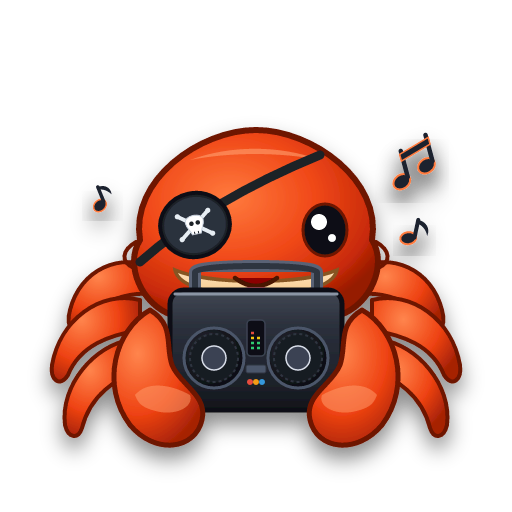

# 🦀 CaranguejoRPG — Escudo do Mestre & Bot de Áudio para Discord

<div align="center">



**O painel tudo-em-um definitivo para Mestres de RPG de Mesa (D&D 5e, Tormenta20, Ordem Paranormal, Vampiro/WoD e Call of Cthulhu).**

[](https://nodejs.org/)
[](https://react.dev/)
[](https://www.typescriptlang.org/)
[](https://discord.js.org/)
[](https://neutralino.js.org/)
[](https://www.docker.com/)

[Funcionalidades](#-funcionalidades-principais) •
[Novos Módulos](#-novos-módulos-e-ferramentas) •
[Guia & Tutoriais](#-tutoriais-passo-a-passo) •
[Início Rápido](#-como-executar-e-usar) •
[Gerar .EXE Portátil](#-gerar-o-executável-portátil-exe) •
[Configurar Bot Discord](#-configuração-do-bot-do-discord) •
[Estrutura de Pastas](#-estrutura-de-arquivos-e-pastas)

</div>

---

## 📖 Visão Geral

O **CaranguejoRPG** é um software de suporte e imersão para mestres de RPG de mesa virtuais (VTTs) ou presenciais. Em vez de alternar entre 10 abas de navegador, bots de música instáveis e planilhas confusas, o CaranguejoRPG unifica **trilha sonora no canal de voz**, **soundboard de efeitos simultâneos**, **loops de ambiente**, **escudo do mestre modular 2D**, **estúdio de mapas e desenhos táticos**, **leitor multi-abas do Discord** e **gerenciamento de fichas de NPCs**.

O aplicativo roda tanto no navegador (`localhost:3000`), quanto como executável nativo ultra-leve de **~5MB sem instalação** (Windows/Linux via Neutralino.js), ou dentro de um container Docker 24/7.

---

## ✨ Funcionalidades Principais

### 🛡️ 1. Escudo do Mestre Modular (Master Screen 2D)
* **Grade 2D Livre com Posicionamento por Células:** Arraste qualquer bloco para soltar na coluna e linha desejadas, configure largura (1/3, 1/2 ou 1/1 tela) e altura (expandido, compacto ou recolhido).
* **Controle Central de Áudio:** Play/Pause, busca na linha do tempo (scrubber), pulo de faixa, volume mestre e da música com fade suave.
* **Mini Soundboard de Resposta Rápida:** Dispare passos, espadas colidindo, magias e rugidos de monstros em 1 clique.
* **Rastreador de Iniciativa & Combate:** Ordene turnos de jogadores e monstros, acompanhe PV (Pontos de Vida), CA (Classe de Armadura) e condições ativas.
* **Rolador de Dados 3D & Clássico:**
  * Dados tradicionais: d4, d6, d8, d10, d12, d20, d100 com modificadores e soma automática.
  * Rolador especializado de **Storyteller / World of Darkness (Vampiro a Máscara, Lobisomem, etc.)**: cálculo de sucessos na dificuldade alvo, falhas críticas (cancelamento no 1) e especialização no 10.
* **Multi-Timers & Cronômetros:** Controle rodadas de combate, duração de magias de concentração e tochas em tempo real.
* **Bloco de Notas Multi-Abas:** Anotações com abas categorizadas e persistidas automaticamente.
* **Scratchpad de Rascunho Rápido:** Área para cálculos e notas temporárias da sessão.
* **Clima & Horário da Sessão:** Acompanhe horário do dia no jogo, fase lunar e condições climáticas.

---

### 🎨 2. Estúdio de Desenho & Controles de Imagem (Paint Studio)
Crie mapas táticos rápidos, anote posições de combate e faça montagens com tokens e mapas em tempo real:
* **Preservação Contínua de Estado:** O desenho e todas as suas camadas permanecem intactos ao navegar entre as abas do software (Mestre, NPCs, Músicas, etc.). Nada é perdido ao alternar de tela.
* **Sistema Avançado de Camadas (Layers):**
  * Suporte a múltiplas camadas independentes (Camadas de Desenho e Camadas de Imagem).
  * ⬆️ ⬇️ **Ordenação e Z-Index:** Botões de *Trazer para Frente* (Bring Forward / Front) e *Enviar para Trás* (Send Backward / Back).
  * 👁️ **Visibilidade:** Ative ou desative qualquer camada sem precisar apagá-la.
  * 🔒 **Bloqueio:** Trave camadas prontas (como o mapa de fundo) para desenhar tokens por cima sem risco de apagar ou mover o fundo.
  * 🎚️ **Opacidade por Camada:** Ajuste a transparência individual de cada elemento ou camada tática.
  * ➕ / 🗑️ **Criar, Duplicar e Excluir Camadas:** Gerencie camadas de grid, névoa de guerra, anotações e monstros.
* **Ferramentas de Traço:** Pincel livre com suavização, borracha com fundo escuro, linha reta, seta tática de indicação, retângulo, círculo/elipse e inserção de texto.
* **Drag & Drop de Imagens:** Arraste arquivos `.png`, `.jpg` ou `.webp` direto para o canvas ou use o botão `+ Imagem`.
* **Controles Avançados de Manipulação de Imagem:**
  * 🔀 **Mover (Move):** Reposicione livremente pela tela, centralize ou preencha o mapa em 1 clique.
  * 📐 **Esticar (Stretch & Resize):** Ajuste fino de largura e altura independentes, com botão de trava de proporção (Aspect Ratio Lock).
  * 🔄 **Manipular (Rotate & Flip):** Girar em ângulos de 90°/-90° ou slider livre de 0° a 360°, espelhamento horizontal (Flip H) e vertical (Flip V).
  * 👻 **Opacidade & Filtros RPG:** Ajuste transparência de 10% a 100% e aplique filtros temáticos instantâneos: *Pergaminho Antigo / Sépia*, *Grimdark P&B*, *Fantasma / Névoa* ou *Normal*.
  * ✂️ **Recortar & Cortar (Cut / Crop):**
    * Aparar bordas da imagem ativa (Crop box).
    * Ferramenta de **Seleção Retangular no Canvas (Marquee Cut)**: selecione qualquer pedaço desenhado para mover como camada flutuante, duplicar ou apagar.
  * 📌 **Fixar no Desenho (Bake):** Mescle a imagem flutuante em uma camada definitiva.
* **Transmissão Direta ao Discord:** Envie o desenho ou mapa com legenda personalizada diretamente para o canal de texto do Discord.

---

### 💬 3. Leitor Multi-Abas do Discord & Chat Integrado
Acompanhe e converse com sua mesa sem precisar abrir a janela pesada do Discord:
* **Múltiplas Abas de Canais:** Abra abas separadas para cada canal de texto (`#geral`, `#rolagens`, `#diario-de-bordo`, `#off-topic`) e alterne instantaneamente. Suas abas abertas ficam memorizadas entre as sessões.
* **Modo Split-View (Divisão de Tela):** Visualize dois canais simultaneamente lado a lado para não perder nenhuma conversa enquanto acompanha rolagens.
* **Separação Precisa de Mensagens:** Balões de chat estilizados com avatares, carimbo de hora, anexos visuais com lightbox e suporte a mensagens do sistema.
* **Identificação Visual por Cores de Jogadores:**
  * Algoritmo determinístico que atribui cores distintas para cada participante do chat.
  * **Painel de Cores dos Jogadores:** Escolha e salve cores específicas para cada jogador da sua mesa através do botão *Cores dos Jogadores* ou na aba de configurações.
* **Botões de Mensagens Rápidas para Jogadores:**
  * 🎲 *Rolem Iniciativa!*
  * ⚔️ *Preparar Rodada de Combate*
  * 👁️ *Teste de Percepção / Prontidão Geral*
  * 🛡️ *Teste de Resistência / Salvaguarda*
  * ✨ *Início de Descanso*
  * 🤫 *Atenção / Silêncio para Narração*
* **Envio com Modos Especiais:** Alterne entre mensagem comum (💬 Fala) ou bloco épico com bordas douradas e formatação de destaque (📜 Narração).

---

### 📋 4. Histórico Imediato no Rodapé (Action Log Footer)
* Componente permanente e não-intrusivo no rodapé da aplicação.
* Exibe as **últimas 3 ações realizadas** com ícones temáticos e tempo relativo:
  * 🎵 *Música iniciada*
  * 🌿 *Ambiente alterado*
  * ⚡ *Efeito sonoro acionado*
  * 🧙 *NPC enviado ao Discord*
  * 🎲 *Dados rolados*
  * 🗺️ *Desenho salvo ou transmitido*
* Botão para expandir histórico detalhado ou limpar registros.

---

### 🌿 5. Player de Ambientação & Loops Contínuos
* **Canal de Áudio Independente:** Toque som ambiente simultaneamente com a trilha musical sem cortes.
* **Loops Contínuos:** Chuva torrencial, ventania, taverna cheia, fogueira, ruínas assombradas e masmorras gotejantes.
* **Volume Separado no Mixer:** Ajuste fino para não abafar a fala na chamada.
* **Pastas Próprias:** Músicas e sons organizados na pasta `data/ambience/`.

---

### ⚔️ 6. Gerador de Encontros & Monstros
* Parametrização por nível do grupo (1 a 20), ambiente (floresta, masmorra, cidade, caverna, montanha, pântano, deserto, alto mar), formação (chefe solo, patrulha ou horda) e dificuldade (fácil a mortal).
* Estatísticas sugeridas de PV, CA, CR, papel tático, complicações de terreno e objetivos dos monstros.
* Envio do encontro formatado ao Discord com 1 clique.

---

### 🎡 7. Roleta de Decisões & Porcentagens Customizáveis
* Roda interativa com fatias proporcionais aos pesos percentuais e física de giro.
* Predefinições prontas: Destino do Herói, Alvo do Ataque, Clima da Viagem e Tensão/Sanidade.
* Transmissão do resultado sorteado para o Discord.

---

### 💎 8. Gerador de Tesouros & Loot
* Geração balanceada por nível (CR 0-4 até CR 17+).
* Riquezas em moedas (PO, PP, PC, PL), gemas preciosas, itens de arte e itens mágicos raros.
* Exportação e postagem formatada para os aventureiros.

---

## 📚 Tutoriais Passo a Passo

### Tutorial 1: Configurando o Bot do Discord em 3 Minutos
1. Acesse o [Discord Developer Portal](https://discord.com/developers/applications) e clique em **"New Application"**.
2. Na aba **Bot**, clique em **"Add Bot"** (ou "Reset Token") e copie o Token.
3. Ative as **Privileged Gateway Intents** (obrigatório):
   * ✅ **MESSAGE CONTENT INTENT**
   * ✅ **SERVER MEMBERS INTENT**
   * ✅ **PRESENCE INTENT**
4. Na aba **Installation** (ou OAuth2 URL Generator), marque os escopos `bot` e `applications.commands` com permissões de Conectar, Falar, Enviar Mensagens e Anexar Arquivos.
5. Adicione o bot ao seu servidor através do link gerado.
6. No CaranguejoRPG, clique em **Configurações** → **Discord Bot** (ou no ícone do Discord no topo).
7. Cole o Token do Bot, selecione sua Guilda, o Canal de Voz e o Canal de Texto padrão e clique em **"Salvar & Conectar"**.

---

### Tutorial 2: Como Usar os Controles de Imagem no Estúdio de Desenho
1. No menu superior, clique na aba **"Desenhar / Paint"** (ou abra o widget de desenho no Escudo do Mestre).
2. Clique no botão **"+ Imagem"** ou arraste um arquivo de imagem diretamente para a tela.
3. A imagem entrará automaticamente no modo de manipulação flutuante:
   * **Mover:** Clique e arraste a imagem para onde quiser na grade.
   * **Esticar:** Use os controles deslizantes de Largura e Altura. Desmarque "Travado" se quiser distorcer livremente.
   * **Rotacionar e Espelhar:** Use os botões `-90°`, `+90°` ou os botões de Flip Horizontal/Vertical.
   * **Filtro RPG:** Clique em *📜 Pergaminho* para transformar um mapa moderno em pergaminho medieval com tonalidade sépia e alto contraste.
   * **Recortar:** Use o botão *Aparar Bordas* ou use a ferramenta *Cortar / Seleção* para selecionar um retângulo no canvas e movê-lo.
4. Quando estiver satisfeito com a posição e efeitos, clique em **"Fixar no Desenho (Bake)"**. A imagem será gravada no mapa.
5. Clique em **"Enviar ao Discord"** para mostrar o mapa aos seus jogadores!

---

### Tutorial 3: Organizando as Abas e Cores no Leitor do Discord
1. Acesse a aba **"Leitor Discord"** no menu superior (ou abra o bloco no Escudo do Mestre).
2. Clique no botão **"+ Aba"** e escolha qualquer canal de texto ou voz do servidor.
3. Alterne entre as abas abertas a qualquer momento; suas abas permanecem salvas na sua sessão.
4. Para visualizar dois canais simultaneamente, clique em **"Dividir Tela"** (Split View).
5. Para configurar cores personalizadas de cada participante:
   * Clique no botão **"Cores dos Jogadores"** no topo do chat.
   * Selecione um jogador recente ou digite o nome de usuário dele.
   * Escolha uma cor da paleta de fantasia para identificação imediata das mensagens e avatares.
6. Use os botões da barra **"Avisos Rápidos"** para solicitar rolagens de Iniciativa, Percepção ou anunciar descansos em 1 clique!

---

### Tutorial 4: Dominando o Sistema de Camadas (Layers) e Preservação
1. Abra o **Estúdio de Desenho & Paint** na aba de NPCs ou no Escudo do Mestre.
2. Observe o painel lateral de **Camadas (Layers)** à direita da tela:
   * **Adicionar Camada:** Clique em `+ Nova Camada` para criar uma camada de anotações ou grid.
   * **Reordenar Profundidade:** Use os botões `▲ Para Frente` e `▼ Para Trás` para posicionar monstros, névoa ou tokens acima ou abaixo do mapa base.
   * **Travar Fundo:** Clique no ícone de 🔒 Cadeado na Camada 1 (fundo) para desenhar à vontade sem risco de apagar a imagem do mapa.
   * **Ocultar / Revelar:** Clique no ícone de 👁️ Olho para esconder armadilhas ou segredos da masmorra antes de transmitir para os jogadores.
3. **Navegue sem medo:** Pode trocar para o Escudo do Mestre, soltar músicas, rolar dados e voltar ao Estúdio de Desenho a qualquer momento — o traçado e todas as camadas continuam exatamente de onde você parou!

---

## 🚀 Como Executar e Usar

### 🌟 Opção 1: Executável Portátil (.EXE — Recomendado para Windows)
1. Baixe o arquivo **`CaranguejoRPG-Portable-Windows.zip`** nas [Releases](../../releases).
2. Extraia o ZIP em qualquer pasta (ou em um Pen Drive).
3. Execute **`CaranguejoRPG.bat`** (ou `CaranguejoRPG-win_x64.exe`).
4. O aplicativo abre instantaneamente em janela nativa super leve (~5MB).

---

### 💻 Opção 2: Modo Servidor Local (Node.js)
```bash
# 1. Instale as dependências
npm install

# 2. Inicie o servidor integrado
npm run dev
```
Acesse `http://localhost:3000` no seu navegador favorito.

---

### 🐳 Opção 3: Docker & Docker Compose
```bash
cp .env.example .env
# Preencha seu DISCORD_BOT_TOKEN no .env
docker compose up -d
```

---

## 📦 Gerar o Executável Portátil (.EXE)

Para compilar seu próprio executável standalone via Neutralino.js:

```cmd
gerar-executavel.bat
```
*(No Linux ou macOS: `./gerar-executavel.sh`)*

A pasta `dist-portable/` conterá o executável nativo pronto para distribuição.

---

## 📂 Estrutura de Arquivos e Pastas

```text
CaranguejoRPG/
├── 📁 data/                  # Seus dados locais persistentes
│   ├── 📁 music/             # Trilhas sonoras (.mp3, .ogg)
│   ├── 📁 ambience/          # Áudios de ambiente contínuos
│   ├── 📁 sfx/               # Efeitos sonoros do soundboard
│   ├── 📁 npcs/              # Retratos de personagens
│   ├── 📁 saves/             # Saves de sessões em JSON
│   └── 📄 db.json            # Banco de dados local
├── 📁 server/                # Backend Express + Discord.js Voice Engine
│   ├── 📄 discordBot.ts      # Cliente Discord, voz e slash commands
│   └── 📄 soundManager.ts    # Gerenciador de trilhas e soundboard
├── 📁 src/                   # Interface React 19 + Tailwind CSS
│   ├── 📁 components/        # Módulos: MasterScreen, DrawingStudio, DiscordReader
│   ├── 📁 context/           # AudioContext (logs, reprodução, estados)
│   └── 📁 types.ts           # Definições completas TypeScript
├── 📄 neutralino.config.json # Configuração do executável nativo
├── 📄 docker-compose.yml     # Orquestrador Docker
└── 📄 package.json           # Dependências do projeto
```

---

## 🤝 Licença

Disponibilizado sob a licença **MIT**. Sinta-se livre para usar na sua mesa, modificar o código, adicionar novos módulos e contribuir com melhorias!

<div align="center">

**Que seus d20s rolem sempre em 20 natural! 🦀🎲⚔️**

</div>
